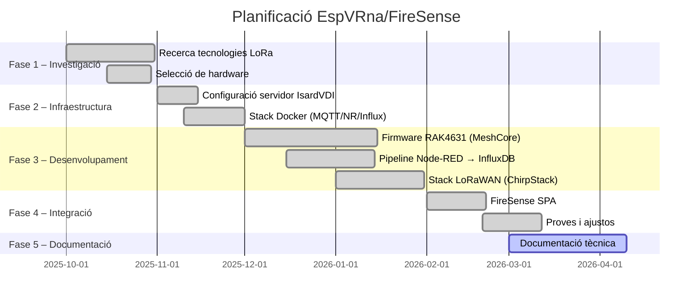

# 01 – Introducció

## Context i motivació

Els incendis forestals representen una de les amenaces ambientals més greus de la conca mediterrània. La serra de **Collserola**, parc natural situat al costat de Barcelona, acull més de 8.000 hectàrees de bosc en un entorn densament urbanitzat, la qual cosa fa que qualsevol incendi tingui un risc altíssim per a persones i infraestructures.

La detecció primerenca —mesos o setmanes abans de l'estiu crític— passa per monitoritzar de forma contínua paràmetres ambientals com:

- **Temperatura ambiental** (un augment sostigut asseca la vegetació)
- **Humitat relativa** (valors inferiors al 25% augmenten el risc)
- **Humitat del sòl** (indicador directe de la sequera del substrat)

Les estacions meteorològiques convencionals costen milers d'euros i no tenen la densitat espacial necessària per a una detecció de qualitat. La tecnologia **LoRa** (*Long Range Radio*) permet desplegar nodes sensor a baix cost i amb bateries que duren mesos, cobrind kilòmetres sense infraestructura de xarxa mòbil.

---

## Abast del projecte

El projecte EspVRna/FireSense cobreix:

1. **Disseny i programació del firmware** dels nodes sensor (RAK4631).
2. **Avaluació comparativa** de dues tecnologies de xarxa LoRa:
   - **MeshCore**: xarxa en malla autorganitzada (sense punt únic de fallada).
   - **LoRaWAN**: arquitectura estrella amb servidor de xarxa centralitzat (ChirpStack).
3. **Desplegament del backend** compartit en contenidors Docker al servidor IsardVDI de l'ITB.
4. **Visualització** de dades en temps real (Grafana + FireSense SPA).
5. **Documentació tècnica** replicable per a futurs projectes o entitats interessades.

Queda **fora d'abast**:
- Desplegament físic permanent a Collserola (és un prototip de laboratori/camp limitat).
- Integració amb sistemes oficials de Protecció Civil o els Bombers de la Generalitat.
- Alimentació solar dels nodes (es preveu com a treball futur).

---

## Metodologia

El projecte segueix una metodologia iterativa dividida en fases:

**Divisió de treball:**

| Àrea | Responsable |
|------|-------------|
| Firmware RAK4631, Heltec V4 companion, meshcore-ha, pipeline MQTT→Node-RED→InfluxDB | **Alejandro Díaz Encalada** |
| ChirpStack v4, gateway RAK WisGate, nodes LoRaWAN, decodificadors de payload | **[Hamza Tayibi]** |
| Backend compartit (Mosquitto, InfluxDB, Grafana, Nginx, Docker) | **Tots dos** |

---

## Estructura de la documentació

| Fitxer | Contingut |
|--------|-----------|
| `00-resum-executiu.md` | Visió general per a qualsevol lector |
| `01-introduccio.md` | Aquest document |
| `02-arquitectura-general.md` | Stack tecnològic i xarxa Docker compartits |
| `03-meshcore.md` | Part MeshCore (Alejandro): firmware, pipeline, Node-RED |
| `04-lorawan.md` | Part LoRaWAN ([Hamza]): ChirpStack, gateway, nodes |
| `05-comparativa.md` | Taula comparativa MeshCore vs LoRaWAN |
| `06-guia-installacio.md` | Com replicar el sistema des de zero |
| `07-conclusions.md` | Conclusions, limitacions i treball futur |
