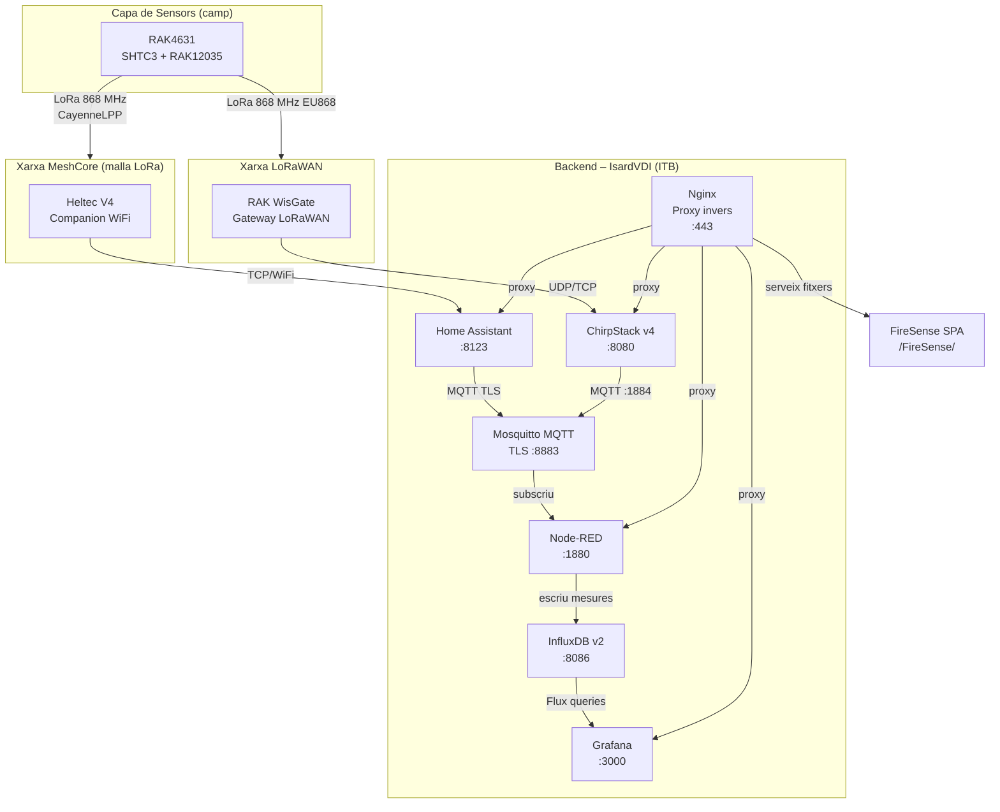
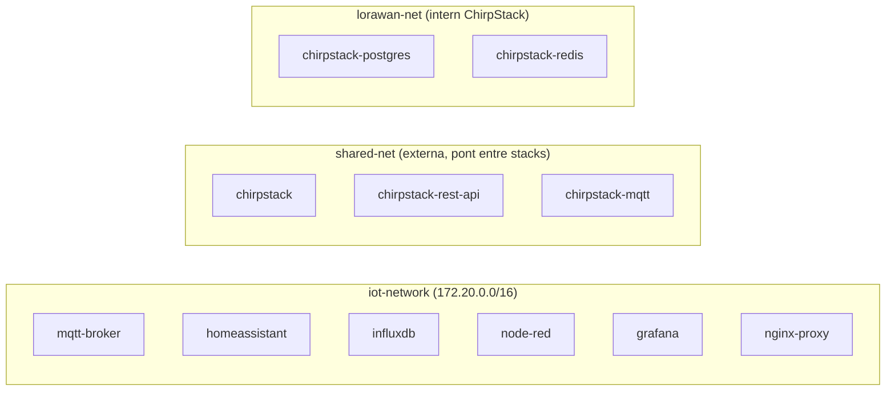

# 02 – Arquitectura General

## Visió global

El sistema EspVRna/FireSense combina dues cadenes de comunicació LoRa (MeshCore i LoRaWAN) que convergeixen en un **backend compartit** allotjat al servidor IsardVDI de l'ITB. Totes les dades acaben a la mateixa base de dades de sèries temporals i es visualitzen des d'un únic punt d'accés HTTPS.



---

## Stack tecnològic compartit

### Contenidors i imatges Docker

| Contenidor | Imatge | Port intern | Funció |
|-----------|--------|-------------|--------|
| `mqtt-broker` | `eclipse-mosquitto:2.0.22` | 8883 (TLS) | Bus de missatgeria |
| `homeassistant` | `ghcr.io/home-assistant/home-assistant:stable` | 8123 | Passarel·la MeshCore |
| `influxdb` | `influxdb:2.7-alpine` | 8086 | BBDD sèries temporals |
| `node-red` | Build local (`node-red/Dockerfile`) | 1880 | Processament de dades |
| `grafana` | `grafana/grafana:11.4.0` | 3000 | Dashboards |
| `nginx-proxy` | `nginx:alpine` | 80, 443, 8443 | Proxy invers + TLS |
| `chirpstack` | `chirpstack/chirpstack:4` | 8080 | Servidor xarxa LoRaWAN |
| `chirpstack-rest-api` | `chirpstack/chirpstack-rest-api:4` | 8090 | API REST ChirpStack |
| `chirpstack-mqtt` | `eclipse-mosquitto:2.0` | 1884 | MQTT intern ChirpStack |
| `chirpstack-postgres` | `postgres:14-alpine` | 5432 | BBDD ChirpStack |
| `chirpstack-redis` | `redis:7-alpine` | 6379 | Cache ChirpStack |

### Xarxa Docker



> **Nota:** `shared-net` es crea manualment (`docker network create shared-net`) abans de llançar cap dels dos stacks. Permet que Nginx (stack principal) enruti cap a ChirpStack (stack LoRaWAN) i que ChirpStack accedeixi a InfluxDB.

### Ordre d'arrencada i dependències

```
shared-net (xarxa externa) → [ha de existir prèviament]
  └── docker-compose up -d (stack principal)
        ├── mqtt-broker  (healthcheck MQTT)
        │     └── homeassistant (depèn de mqtt-broker healthy)
        ├── influxdb (healthcheck HTTP /ping)
        │     ├── node-red (depèn de influxdb started)
        │     └── grafana (depèn de influxdb healthy)
        └── nginx-proxy
  └── docker-compose -f lorawan-gateway/docker-compose.lorawan.yml up -d
        ├── chirpstack-mqtt
        ├── postgres
        ├── redis
        └── chirpstack (depèn dels tres anteriors)
              └── chirpstack-rest-api
```

---

## Nginx – Proxy invers i encaminament

El domini del servidor és:
```
f5bd4ae6-64ea-466d-990b.372acb14d1b3.isard.nuvulet.itb.cat
```

Nginx escolta als ports 80 (redirigeix a HTTPS), 443 i 8443. Les rutes publicades:

| URL pública | Destí intern | Protocol |
|-------------|-------------|----------|
| `/` | `homeassistant:8123` | HTTP + WebSocket |
| `/nodered/` | `node-red:1880/nodered/` | HTTP + WebSocket |
| `/grafana/` | `grafana:3000` | HTTP |
| `/chirpstack/` | `chirpstack:8080` | HTTP + WebSocket |
| `/chirpstack-api/` | `chirpstack-rest-api:8090` | HTTP (CORS obert) |
| `/influxdb/` | `influxdb:8086` | HTTP (CORS obert) |
| `/FireSense/` | Fitxers estàtics (`mi-web-html/`) | HTTP |
| `/api/` | `https://10.0.0.28/api/` | Proxy → RAK WisGate |
| `/rak/` | `https://10.0.0.28/` | Proxy → RAK WisGate UI |

Els certificats TLS del servidor (Let's Encrypt o similar) es monten des de:
```
/home/isard/certs/fullchain.pem
/home/isard/certs/privkey.pem
```

---

## Certificats TLS – MQTT

El broker Mosquitto usa **TLS mutu** (TLS 1.2+). Hi ha dos jocs de certificats:

### Certificats MQTT interns (`mqtt/certs/`)
Generats amb el script `mqtt/scripts-certificados-mqtt.sh`:

```bash
# CA pròpia del projecte
openssl req -new -x509 -days 365 -nodes \
  -out ca.crt -keyout ca.key \
  -subj "/CN=PROJECTEESPVRNA-CA/O=PROJECTEESPVRNA/C=ES"

# Certificat servidor (SAN inclou el nom DNS del contenidor)
openssl x509 -req -in server.csr -CA ca.crt -CAkey ca.key \
  -CAcreateserial -out server.crt -days 365 -sha256 \
  -extfile <(printf "subjectAltName=DNS:mqtt-broker,DNS:localhost,IP:127.0.0.1")
```

El **Common Name del servidor és `mqtt-broker`**, que coincideix exactament amb el hostname del contenidor Docker. Node-RED verifica el certificat del servidor usant `ca.crt` muntat a `/data/certs/ca.crt`.

### Usuaris MQTT (`mqtt/passwd`)
Generat amb `mqtt/scripts-contraseñas.sh`:

| Usuari | Contrasenya (dev) | Ús |
|--------|-------------------|----|
| `meshtastic_user` | `pirineus` | Dispositius sensor |
| `node_red_user` | `pirineus` | Node-RED |
| `monitor_user` | `pirineus` | Health check Docker |

> **Important:** Canviar les contrasenyes en producció. El health check del contenidor Mosquitto usa `monitor_user`.

---

## InfluxDB – Estructura de dades

| Paràmetre | Valor |
|-----------|-------|
| **Versió** | InfluxDB 2.7 |
| **Organització** | `EspVRna` (variable `${INFLUXDB_ORG}`) |
| **Bucket principal** | `sensor_data` |
| **Retenció** | 30 dies |
| **Autenticació** | Token (`${INFLUXDB_ADMIN_TOKEN}`) |
| **Llenguatge de consulta** | Flux |

### Measurement principal (escrit per Node-RED)

```
measurement: collserola_sensors
tags:
  location = "collserola"
  source   = "meshtastic"
fields:
  temperature (float, °C)
  humidity    (float, %)
  pressure    (float, hPa)
```

### Exemple de consulta Flux

```flux
from(bucket: "sensor_data")
  |> range(start: -1h)
  |> filter(fn: (r) => r._measurement == "collserola_sensors")
  |> filter(fn: (r) => r._field == "temperature")
```

---

## Variables d'entorn (`.env`)

Totes les credencials es gestionen via fitxer `.env` (mai comitejat). Plantilla a `.env.example`:

```env
# InfluxDB
INFLUXDB_USER=admin
INFLUXDB_PASSWORD=CHANGE_ME
INFLUXDB_ORG=EspVRna
INFLUXDB_BUCKET=sensor_data
INFLUXDB_ADMIN_TOKEN=CHANGE_ME
INFLUXDB_RETENTION=30d

# Grafana
GRAFANA_USER=admin
GRAFANA_PASSWORD=CHANGE_ME
```

---

## Servidor IsardVDI

IsardVDI és la plataforma de virtualització de l'ITB. El servidor del projecte és una màquina virtual Linux accessible externament al domini indicat. Les característiques rellevants per al desplegament:

- Accés per SSH a la VM.
- Docker i Docker Compose instal·lats.
- Certificats TLS a `/home/isard/certs/` (gestionats externament, fora del repositori).
- La xarxa `shared-net` s'ha de crear manualment una vegada: `docker network create shared-net`.
- Timezone configurada a `Europe/Madrid` en tots els contenidors.
