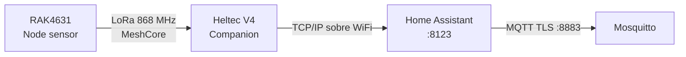
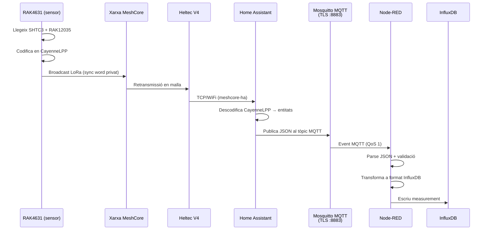
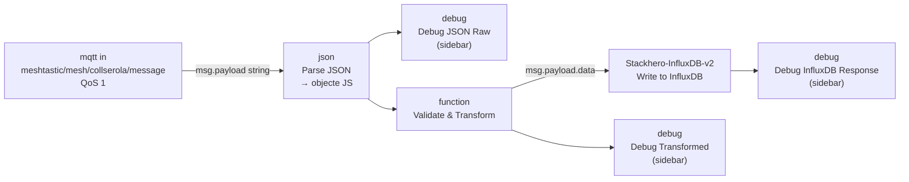
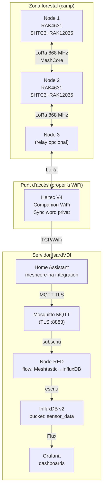

# 03 – Part MeshCore (Alejandro Díaz Encalada)

## Introducció a MeshCore

**MeshCore** és un protocol de xarxa en malla (*mesh*) dissenyat per a comunicacions LoRa de llarg abast sense infraestructura centralitzada. A diferència de LoRaWAN (arquitectura estrella), MeshCore permet que cada node actuï alhora com a sensor i com a repetidor (*relay*), augmentant la cobertura de forma orgànica.

### Per què MeshCore per a prevenció d'incendis?

En un entorn boscós com Collserola, la topologia en malla aporta:
- **Redundància**: si un node falla, les dades es reencaminen per altres nodes.
- **Cobertura incremental**: afegir nodes augmenta l'àrea coberta sense canviar la infraestructura central.
- **Autonomia**: no depèn de cobertura mòbil ni de gateways de pagament.

---

## Hardware del node sensor

### RAK4631 – Microcontrolador principal

El **RAK4631** és el mòdul principal del node sensor. Combina en un sol mòdul:

| Component | Descripció |
|-----------|-----------|
| **MCU** | Nordic nRF52840 (ARM Cortex-M4, 64 MHz, 1 MB Flash, 256 KB RAM) |
| **Ràdio LoRa** | Semtech SX1262 (868 MHz banda EU) |
| **BLE 5.0** | Per a configuració local |
| **Consum deep-sleep** | ~2 µA (ideal per a bateria) |

El RAK4631 s'integra a la placa **RAK5005-O WisBlock Base**, que proporciona les ranures per als mòduls de sensor i l'alimentació.

### SHTC3 – Sensor de temperatura i humitat

El **SHTC3** és un sensor digital d'alta precisió de Sensirion connectat per **I2C** (adreça `0x70`):

| Paràmetre | Especificació |
|-----------|--------------|
| Temperatura | −40°C a +125°C, ±0,2°C |
| Humitat relativa | 0–100% HR, ±2% HR |
| Interfície | I2C |
| Consum mesura | 430 µA |
| Consum sleep | 0,5 µA |

### RAK12035 – Sensor d'humitat del sòl

El **RAK12035** és un mòdul WisBlock que mesura la capacitància del sòl per determinar-ne la humitat:

| Paràmetre | Especificació |
|-----------|--------------|
| Rang mesura | 0–100% (humitat volumètrica) |
| Interfície | I2C |
| Alimentació | 3,3 V |
| Aplicació | Mesura sequera del substrat forestal |

> **Rellevància per a incendis:** L'humitat del sòl inferior al 20–25% és un indicador de risc alt d'incendi, ja que la vegetació morta és altament inflamable.

---

## Protocol de codificació: CayenneLPP

**CayenneLPP** (*Cayenne Low Power Payload*) és un format de codificació binari dissenyat per a IoT. En lloc d'enviar JSON (costós en bytes), el firmware codifica les mesures en un buffer compacte de pocs bytes.

### Format del paquet CayenneLPP

Cada mesura ocupa 2 bytes de capçalera + N bytes de dades:

```
[canal (1B)] [tipus (1B)] [dades (N bytes)]
```

### Mapes de tipus usats al projecte

| Canal | Tipus | Bytes dades | Resolució | Mesura |
|-------|-------|-------------|-----------|--------|
| 1 | `0x67` (Temperature) | 2 | 0,1 °C | Temperatura SHTC3 |
| 2 | `0x68` (Humidity) | 1 | 0,5 % | Humitat SHTC3 |
| 3 | `0x02` (Analog Input) | 2 | 0,01 | Humitat sòl RAK12035 |

### Exemple de paquet (hex)

Per a: temperatura=25,4°C, humitat=62%, humitat sòl=35%:

```
01 67 00 FE   → canal 1, temperatura, 254 × 0,1 = 25,4°C
02 68 7C      → canal 2, humitat, 124 × 0,5 = 62%
03 02 0D AC   → canal 3, analog, 3500 × 0,01 = 35,00%
```

### Avantatges de CayenneLPP vs JSON

| | CayenneLPP | JSON |
|-|------------|------|
| Mida típica | ~10 bytes | ~80 bytes |
| Consum aire | Mínim | 8× més |
| Vida bateria | Màxima | Reduïda |
| Decodificació | Estàndard | Custom |

---

## Heltec V4 – Companion WiFi

El **Heltec V4** (ESP32-S3 + SX1262 LoRa) és un segon dispositiu que actua de **passarel·la entre la xarxa MeshCore i la xarxa WiFi local**.

### Paper al sistema



### Funcionament

1. El Heltec V4 s'uneix a la xarxa MeshCore com un node normal (amb la **mateixa sync word privada**).
2. Simultàniament es connecta a la xarxa WiFi local (la del servidor IsardVDI o del laboratori).
3. Exposa un **servidor TCP** (port [TODO: port]) que la integració `meshcore-ha` de Home Assistant consulta.
4. Converteix els paquets MeshCore (CayenneLPP) en missatges llegibles per Home Assistant.

### Per què Heltec V4 i no directament a WiFi des del RAK4631?

El RAK4631 té ràdio LoRa i BLE però **no WiFi**. Separar les funcions té avantatges:
- El node sensor (RAK4631) pot estar al camp, allunyat de la WiFi, i transmetre per LoRa.
- El companion (Heltec V4) es col·loca a prop d'un punt d'accés WiFi (edifici, repetidor).

---

## Sync Word privat

La **sync word** és un byte de configuració del mòdul SX1262 que funciona com a "canal privat": dos dispositius LoRa **han de tenir la mateixa sync word** per a poder-se escoltar.

### Configuració

- **LoRa públic (Meshtastic/MeshCore per defecte):** `0x34`
- **EspVRna (privat):** `[TODO: valor real del sync word configurat al firmware]`

Canviar la sync word del valor per defecte fa que:
- Els nodes del projecte **no interfereixin** amb altres xarxes MeshCore/Meshtastic de la zona.
- Tercers no puguin injectar dades falses a la xarxa del projecte.

> **Nota de seguretat:** La sync word NO és xifratge. Qualsevol receptor LoRa amb la mateixa sync word pot escoltar els paquets. Per a dades sensibles cal afegir xifratge AES a nivell d'aplicació.

### On es configura

La sync word es defineix al firmware del RAK4631 i del Heltec V4 en la inicialització del mòdul SX1262:

```cpp
// Exemple de configuració (Arduino/PlatformIO)
radio.setSyncWord(0xXX);  // [TODO: valor real]
```

---

## meshcore-ha – Integració Home Assistant

**`meshcore-ha`** és una integració personalitzada de Home Assistant que permet que HA es comuniqui amb la xarxa MeshCore a través del companion Heltec V4.

### Instal·lació

L'integració es pot instal·lar via HACS (Home Assistant Community Store) o manualment copiant la carpeta a `custom_components/meshcore/`:

```
ha-config/
└── custom_components/
    └── meshcore/
        ├── __init__.py
        ├── manifest.json
        ├── sensor.py
        └── ...
```

### Configuració a Home Assistant

A `configuration.yaml` o via la UI d'HA:

```yaml
# [TODO: Configuració real de meshcore-ha]
meshcore:
  host: [IP del Heltec V4]
  port: [TODO: port TCP]
```

### Entitats generades per HA

Per cada node MeshCore detectat, Home Assistant crea entitats com:

| Entitat | Tipus | Dades |
|---------|-------|-------|
| `sensor.meshcore_node_XX_temperature` | Sensor | Temperatura (°C) |
| `sensor.meshcore_node_XX_humidity` | Sensor | Humitat relativa (%) |
| `sensor.meshcore_node_XX_soil_moisture` | Sensor | Humitat sòl (%) |
| `sensor.meshcore_node_XX_rssi` | Sensor | Intensitat senyal LoRa (dBm) |
| `sensor.meshcore_node_XX_battery` | Sensor | Bateria (%) |

---

## Pipeline de telemetria: del sensor fins a InfluxDB

El flux complet de dades per la via MeshCore és:



### Tòpic MQTT

```
meshtastic/mesh/collserola/message
```

> El tòpic usa el prefix `meshtastic/` per compatibilitat amb l'ecosistema, tot i que el protocol de xarxa és MeshCore.

### Format JSON publicat per Home Assistant

```json
{
  "temperature": 24.5,
  "humidity": 58.0,
  "pressure": 1012.3
}
```

> **Nota:** El camp `pressure` (pressió atmosfèrica) es pot obtenir del SHTC3 si s'afegeix un sensor de pressió com el BME280, o pot ser un valor calculat/[TODO: confirmar font].

### Missatge de presència (birth/will)

Node-RED publica missatges d'estat al tòpic:
```
meshtastic/mesh/collserola/node-red/status
```

- **Connexió:** `{"status":"online","timestamp":"...","service":"node-red"}`
- **Desconnexió:** `{"status":"offline"}`

---

## Node-RED – Flow de processament

El flow de Node-RED (`node-red/flows.json`) implementa la ingesta de dades des del tòpic MQTT fins a InfluxDB.

### Diagrama del flow



### Node MQTT In (`mqtt-in-node-001`)

```
Tòpic:    meshtastic/mesh/collserola/message
QoS:      1 (almenys una entrega)
Broker:   mqtt-broker (mqtt-broker:8883)
TLS:      CA cert a /data/certs/ca.crt
ClientID: node-red-iot
```

**Configuració TLS del broker:**
```json
{
  "ca": "/data/certs/ca.crt",
  "servername": "mqtt-broker",
  "verifyservercert": true
}
```

### Node Function – Validate & Transform

Aquest node és el cor de la transformació. Extreu els camps del JSON, valida que existeixin i construeix el payload per a InfluxDB:

```javascript
// Extraer valores originales
const temp = msg.payload.temperature;
const hum  = msg.payload.humidity;
const pres = msg.payload.pressure;

// Validar: si falta algun camp, descartar el missatge
if (!temp || !hum || !pres) {
    return null;  // null = no continua el flow
}

// Construir payload per al node InfluxDB (format Stackhero)
msg.payload = {
    data: [{
        measurement: "collserola_sensors",
        fields: {
            temperature: Number(temp),
            humidity:    Number(hum),
            pressure:    Number(pres)
        },
        tags: {
            location: "collserola",
            source:   "meshtastic"
        }
    }]
};

return msg;
```

> **Format `data`:** El node `Stackhero-InfluxDB-v2-write` (paquet `node-red-contrib-influxdb`) requereix que el payload tingui una propietat `data` amb l'array de punts. Sense aquesta estructura, l'escriptura falla silenciosament.

### Node InfluxDB Write (`influxdb-stackhero-write`)

Configuració del node (referència a `influxdb-stackhero-config`):

| Paràmetre | Valor |
|-----------|-------|
| Servidor | `http://influxdb:8086` |
| Organització | llegida de `functionGlobalContext.influxdb_org` |
| Bucket | llegit de `functionGlobalContext.influxdb_bucket` |
| Token | llegit de variable d'entorn `INFLUXDB_ADMIN_TOKEN` |

### Nodes de debug

Hi ha tres nodes de debug actius (visibles al sidebar de Node-RED):

| Node | Mostra |
|------|--------|
| `Debug JSON Raw` | Payload JSON rebut del MQTT, abans de validar |
| `Debug Transformed` | Payload ja transformat (format InfluxDB) |
| `Debug InfluxDB Response` | Resposta completa del node d'escriptura |

Útils durant el desenvolupament; en producció es poden desactivar per reduir soroll als logs.

---

## Paquet npm de Node-RED

El `node-red/package.json` declara les dependències instal·lades a la imatge Docker:

```json
{
  "dependencies": {
    "node-red-contrib-influxdb": "latest",
    "node-red-contrib-mqtt-all": "latest"
  }
}
```

- **`node-red-contrib-influxdb`**: Proporciona els nodes `Stackhero-InfluxDB-v2-write` i `Stackhero-InfluxDB-v2-query`.
- **`node-red-contrib-mqtt-all`**: Nodes MQTT avançats (suport TLS complet).

---

## Configuració de Node-RED (`settings.js`)

Paràmetres rellevants:

```javascript
httpAdminRoot: "/nodered/",       // UI accessible a /nodered/
httpNodeRoot:  "/nodered/api",    // Endpoints HTTP a /nodered/api

functionGlobalContext: {
    influxdb_bucket: process.env.INFLUXDB_BUCKET || "sensor_data",
    influxdb_org:    process.env.INFLUXDB_ORG    || "PROJECTEESPVRNA"
}
```

L'autenticació de l'editor usa hash bcrypt:
```javascript
users: [{
    username: "admin",
    password: "$2b$12$9VcpnAx295F2Kfjs6n00jO...", // bcrypt
    permissions: "*"
}]
```

> Per canviar la contrasenya: `node-red-admin hash-pw` i substituir el hash.

---

## Diagrama de desplegament del subsistema MeshCore



---

## Troubleshooting comú

### Node-RED no es connecta al MQTT

1. Verificar que `mqtt/certs/ca.crt` existeix i coincideix amb el cert generat.
2. Verificar que el contenidor Node-RED munta el cert: `./node-red/ca.crt:/data/certs/ca.crt:ro`
3. El `servername` del TLS ha de ser `mqtt-broker` (el hostname Docker, no `localhost`).

### Dades no arriben a InfluxDB

1. Activar el node *Debug JSON Raw* i verificar que el JSON té els camps `temperature`, `humidity`, `pressure`.
2. Verificar que el payload transformat té la propietat `data` (array). Sense `data`, el node InfluxDB no escriu.
3. Comprovar el token d'InfluxDB a la configuració del node Stackhero.

### Home Assistant no veu els nodes MeshCore

1. Verificar que el Heltec V4 té la mateixa sync word que el RAK4631.
2. Verificar que la integració `meshcore-ha` té la IP/port correctes del Heltec V4.
3. Revisar els logs de HA: `docker-compose logs -f homeassistant`.
