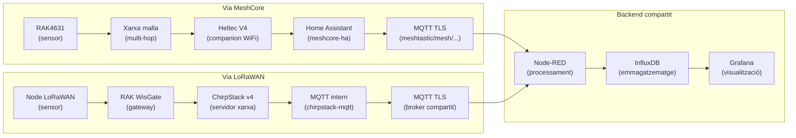

# 05 – Comparativa MeshCore vs LoRaWAN

## Objectiu de la comparativa

El projecte EspVRna/FireSense ha desplegat **les dues tecnologies en paral·lel** sobre el mateix entorn d'incendis forestals a Collserola, amb el mateix backend compartit. Això permet fer una comparativa justa basada en experiència real, no en especificacions teòriques.

---

## Taula comparativa principal

| Criteri | MeshCore | LoRaWAN |
|---------|----------|---------|
| **Topologia** | Malla (*mesh*) autorganitzada | Estrella (node → gateway → servidor) |
| **Estàndard** | Protocol obert (fork de Meshtastic) | Estàndard internacional (LoRa Alliance) |
| **Servidor de xarxa** | No en cal (la malla és autònoma) | ChirpStack v4 (o AWS IoT, TTN, etc.) |
| **Infraestructura central** | Mínima (1 companion WiFi) | Requereix gateway LoRaWAN dedicat |
| **Punt únic de fallada** | No (qualsevol node fa de relay) | Sí (si falla el gateway, no hi ha dades) |
| **Abast node-a-node** | ~1–5 km (LoRa, línea de visió) | ~2–15 km (amb gateway en alçada) |
| **Abast total de la xarxa** | Creix amb cada node afegit | Limitat al radi del gateway |
| **Nombre de nodes** | Ilimitat teòricament (el routing escala) | Depenent del duty cycle i la capacitat del GW |
| **Latència** | Més alta (multi-hop possible) | Baixa (1 salt node→gateway) |
| **Consum energètic** | Més alt (el mòdul LoRa escolta contínuament per fer relay) | Molt baix (deep-sleep entre transmissions) |
| **Vida de bateria** | [TODO: mesurar] dies/setmanes | [TODO: mesurar] setmanes/mesos |
| **Codificació payload** | CayenneLPP (binari compacte) | CayenneLPP / JSON / custom |
| **Seguretat RF** | Sync word privada (ofuscació, no xifratge) | AES-128 a nivell de sessió (estàndard) |
| **Configuració de xarxa** | Simple (mateixa sync word = mateixa xarxa) | Més complexa (OTAA/ABP, AppKey, JoinServer) |
| **Decodificació payload** | A Home Assistant (meshcore-ha) | Al servidor ChirpStack (codec JS) |
| **Passarel·la WiFi** | Heltec V4 (ESP32) | RAK WisGate (hardware dedicat) |
| **Cost hardware node** | ~30–50€ (RAK4631 + sensors) | [TODO: cost real] |
| **Cost gateway** | ~30€ (Heltec V4) | ~150–300€ (RAK WisGate) |
| **Cost servidor de xarxa** | 0€ (no en cal) | 0€ (ChirpStack és open-source) |
| **Complexitat de desplegament** | Baixa (plug-and-play si tens companion) | Mitjana (cal registrar gateway i dispositius) |
| **Suport de comunitat** | Creixent (fork actiu de Meshtastic) | Molt ampli (estàndard industrial) |
| **Ecosistema de hardware** | Limitat (Meshtastic/MeshCore compatible) | Enorme (milers de dispositius certificats) |
| **Actuació a Collserola** | [TODO: resultats reals] | [TODO: resultats reals] |

---

## Comparativa de la cadena de dades

---

## Casos d'ús recomanats

### Quan triar MeshCore

- Zones sense cobertura WiFi/4G i sense gateway fix disponible.
- Necessitat de **redundància**: si un node cau, la malla continua funcionant.
- Desplegaments **ràpids** i temporals (fires, emergències).
- Nombre baix/mig de nodes (< 50) on la latència afegida del mesh no és crítica.
- Pressupost limitat per al gateway.

### Quan triar LoRaWAN

- Desplegaments **permanents** amb gateway en un punt estratègic elevat.
- Nombre **gran** de nodes (desenes a centenars).
- Requeriment de **consum mínim** i màxima vida de bateria.
- Necessitat d'integrar dispositius comercials de tercers (sensors certificats LoRaWAN).
- Entorns on cal **seguretat estandarditzada** (AES-128 natiu).

---

## Resultats experimentals

> [TODO: Omplir amb les mesures reals obtingudes durant el projecte]

### Cobertura

| Escenari | MeshCore | LoRaWAN |
|----------|----------|---------|
| Node a 500m, terreny pla | [TODO] dBm RSSI | [TODO] dBm RSSI |
| Node a 1 km, bosc dens | [TODO] | [TODO] |
| Node a 2 km, line-of-sight | [TODO] | [TODO] |
| Pèrdua de paquet (PER) | [TODO] % | [TODO] % |

### Consum energètic

| Fase | MeshCore (RAK4631) | LoRaWAN (node) |
|------|-------------------|----------------|
| Mesura sensors | [TODO] mA | [TODO] mA |
| Transmissió LoRa | [TODO] mA | [TODO] mA |
| Espera (relay actiu) | [TODO] mA | N/A |
| Deep-sleep | [TODO] µA | [TODO] µA |
| **Autonomia estimada** (bateria 3000 mAh) | **[TODO] dies** | **[TODO] dies** |

### Latència extrem a extrem

| Via | Latència típica (sensor → InfluxDB) |
|-----|-----------------------------------|
| MeshCore (1 hop) | [TODO] ms |
| MeshCore (3 hops) | [TODO] ms |
| LoRaWAN | [TODO] ms |

---

## Conclusions de la comparativa

[TODO: Completar amb les conclusions reals obtingudes durant el projecte]

Des del punt de vista del **prototip de prevenció d'incendis a Collserola**, ambdues tecnologies han demostrat ser viables. Les diferències clau observades han estat:

1. **MeshCore** ha resultat més senzill de configurar inicialment i ofereix millor redundància, però consumeix més energia per la funció de relay.

2. **LoRaWAN** ha mostrat millor eficiència energètica i és la tecnologia preferida per a desplegaments permanents i escalables, però requereix planificar bé la ubicació del gateway.

3. Per a un sistema de producció a Collserola, la solució òptima podria ser una **combinació d'ambdues**: LoRaWAN per als nodes permanents amb energia solar, i MeshCore per als desplegaments temporals d'emergència.
